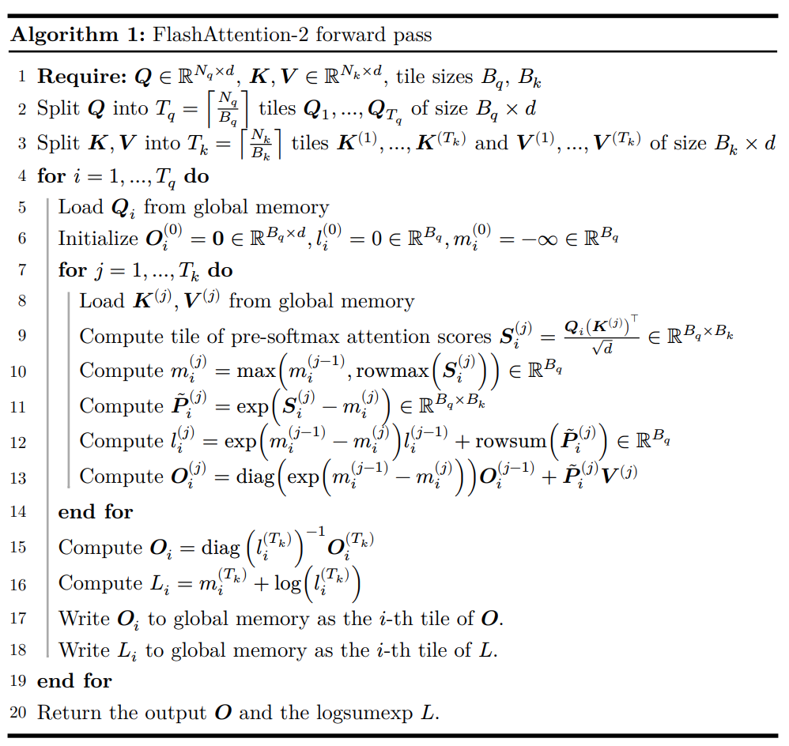
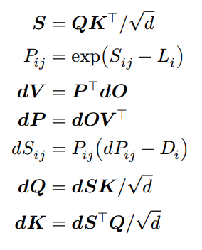
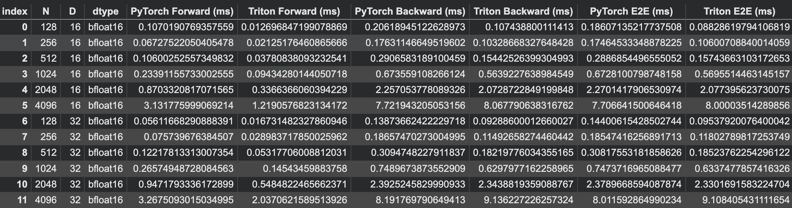

# FlashAttention2-triton-kernel
Implemetation of FlashAttention2 in triton, operator fusion and recomputation. Also benchmarking with the Pytorch attention

## Objective
1. Triton kernel, jit (forward)
2. pytorch (backward)
3. Memory access limiting technique (Operator fusion and recomputation)
4. Benchmarking (triton kernel vs pytorch)

## FlashAttention2 algorithm
### Forward
<p align="center">
  
</p>

### Backward
<p align="center">
  
</p>

## Benchmarking
### Hardware: T4 15GB GPU
The forward opration triton kernel performs better than pytorch up to d = 128 but performs lower than pytorch when the dimension of the model increases. It is expected as the kernel implementation doesnot have the same matrix-matrix operation opperation. 

 <p align="center">
  
</p>

## Results
The result of the testing can be found inside assets/benchmark.csv for detail inspection.
Use the code to read the file
```code
import pandas as pd

df = pd.read_csv('assets/benchmark.csv')

print(df.head())
```

